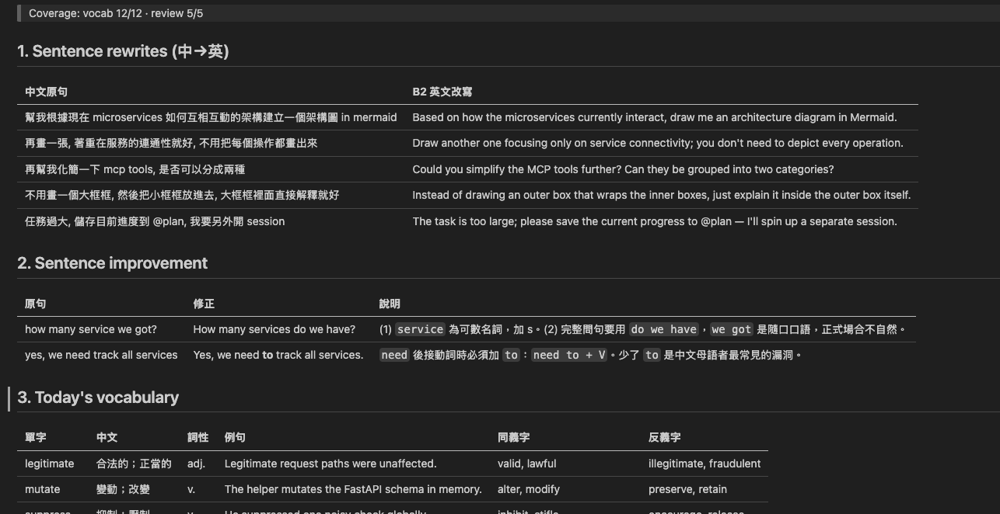

# promptlingo

透過分析你跟 Claude Code 的對話,順便練英文。

## 概念

你跟 Claude Code 的對話原本就完整存在 `~/.claude/projects/*.jsonl`。本專案提供一個 Agent Skill `promptlingo`,讀取 JSONL,過濾雜訊(code、路徑、tool I/O、系統訊息),依你設定的 CEFR 等級產出每日學習素材:

1. **句型改寫** — 你的中文 prompt → 多種英文表達
2. **句型改善** — 你的英文 prompt → 文法 / 用字修正
3. **單字** — 從對話內挑符合等級的字(含略高一級延伸)
4. **文法重點** — 整體歸納

## Demo




## 前置需求

- **Python 3.10+**
- **[Claude Code](https://docs.claude.com/en/docs/claude-code)** 已安裝且至少使用過一次,確認 `~/.claude/projects/` 內有 `.jsonl` 對話檔
- macOS

## 安裝

執行安裝腳本(會 seed 空的 `vocab.json` / `patterns.json`,並建立 symlink 到 `~/.claude/skills/promptlingo`):

```bash
./install.sh
```

> 已存在的執行期資料檔不會被覆寫。執行期 `vocab.json` / `patterns.json` 已被 gitignore,模板放在 `skills/promptlingo/data/templates/`。

編輯 `skills/promptlingo/config.json` 設定等級:

```json
{ "level": "B2", "native_lang": "zh-TW", "target_lang": "en" }
```

## 使用

在任何 Claude Code session 內:

- `/promptlingo` — 分析今天
- `/promptlingo 2026-04-25` — 指定日期

報告寫到 `skills/promptlingo/data/reports/<DATE>/summary.md`,
單字累積在 `data/vocab.json`,易錯句型在 `data/patterns.json`。